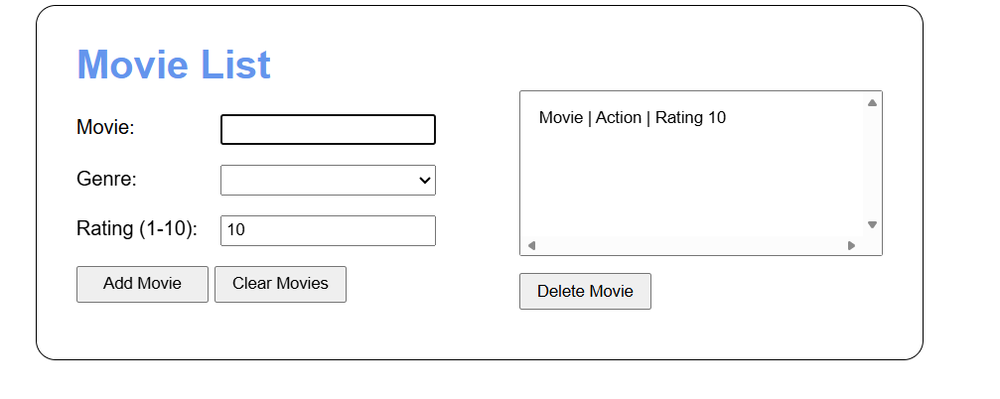
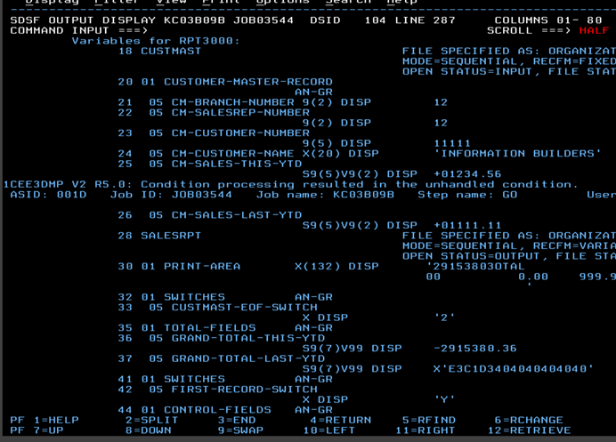
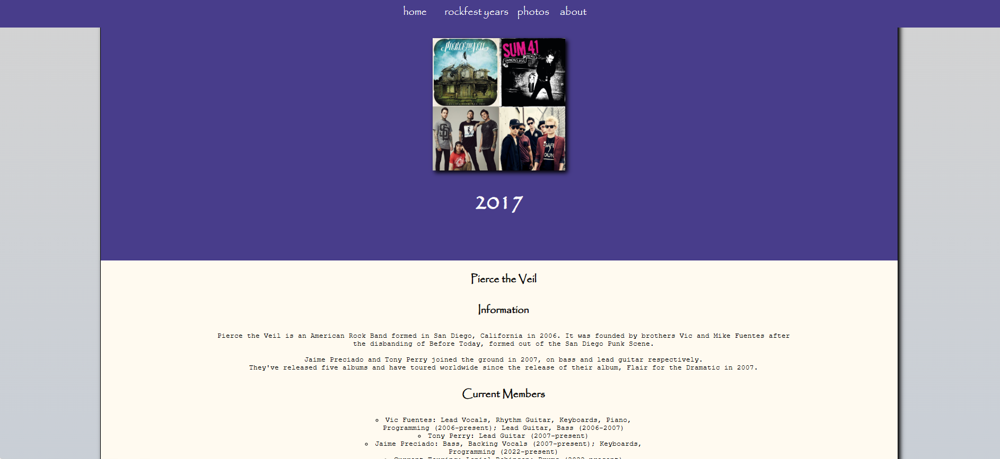
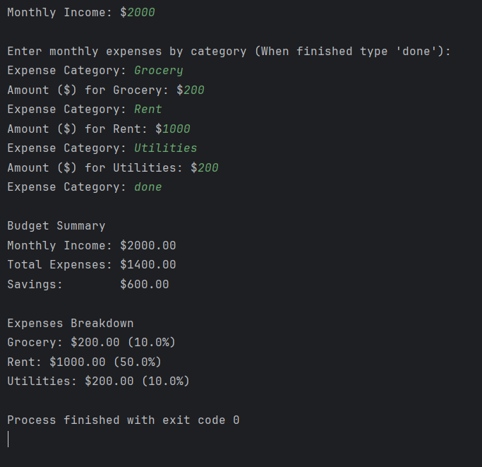

# :desktop_computer: Developer Portfolio: Gateway

------------

<b>Author</b>: Taylor Rath  
<b>Course</b>: CSC465 Advanced Web Development 

Welcome to my GitHub Portfolio repository!  
I am currently studying Computer Information Systems at Wayne State College. This
gateway serves as a central directory to navigate my
coursework. 

## :card_index_dividers:Table of Contents

-----------------

| Repository                        | Primary Tech | Category                             | Description                                                                                    | Repo                                                        |
|-----------------------------------|--------------|--------------------------------------|------------------------------------------------------------------------------------------------|-------------------------------------------------------------|
| [Media Tracker](#media-tracker)   | JavaScript   | CSC465 Advanced Web Development      | Categorizes Movies by genre & ratings.                                                         | [Media Tracker](https://github.com/tarath01/Media-Tracker)  |
| [RPT3000](#rpt3000)               | COBOL        | CIS352 Intro to Enterprise Computing | Cobot based report designed to analyze and summarize yearly performances across multiple tiers | [RPT3000](https://github.com/tarath01/RPT3000)              |
| [Rockfest](#rockfest)             | HTML/CSS     | CSC165 Intro to Web Development      | Website Development to provide information to users about previous artists performances        | [RockFest](https://github.com/tarath01/Rockfest)            |
| [Budget Planner](#budget-planner) | Python       | CIS442 Programming Design & Document | Program is designed to plan budgeting summary                                                  | [Budget Planner](https://github.com/tarath01/BudgetPlanner) |

---------------------------------------------------------------

## :open_file_folder: Project Summaries

------------------------------

## Media Tracker

<b>Short Summary</b>: In this program, will be a movie tracker. You will be able to add everything from the movie you watched, genre,
and a rating from 1-10 that you wish to give the movie.

<b>Technologies Used</b>:
  - Javascript
  - CSS
  - HTML

<b>Key Learning Concepts</b>:
  - Working with Arrays
  - How to work with Objects: Property / Methods, Constructors, Setters / Getters, etc.
  - How to work with Modules: Import / Export
  - Auto-Generated Unique ID, Title, Genre, & Rating

<b>Project Status</b>: :heavy_check_mark: Completed 
<b>Course / Self-Project</b>: CSC465 Advance Web Development

<b>Repository Link</b>: [Media Tracker](https://github.com/tarath01/Media-Tracker)

<b>[Back to TOC](#card_index_dividerstable-of-contents)</b>

-------

## RPT3000

<b>Short Summary</b>: This program is a COBOL based reporting designed to analyze and summarize
yearly sales performances across multiple tiers.

<b>Technologies Used</b>:
  - COBOL
  
<b>Key Learning Concepts</b>:
  - YTD Change Amount & Percent
  - CUSTMAST
  - Record Switch

<b>Project Status</b>: :heavy_check_mark: Completed

<b>Course / Self-Project</b>: CIS352 Intro to Enterprise Computing

<b>Repository Link</b>: [RPT3000](https://github.com/tarath01/RPT3000)

[Back to TOC](#card_index_dividerstable-of-contents)

--------------------------

## Rockfest

<b>Short Summary</b>: This website was developed to provide information to users
about previous artist's performances.
 
<b>Technologies Used</b>: 
  - HTML
  - CSS

<b>Key Learning Concepts</b>:
  - Drop-Down List
  - CSS

<b>Project Status</b>: :heavy_check_mark: Completed  
<b>Course / Self-Project</b>: CSC165 Intro to Web Development

<b>Repository Link</b>: [Rockfest](https://github.com/tarath01/Rockfest)

[Back to TOC](#card_index_dividerstable-of-contents)

---------------------------------------------

## Budget Planner

<b>Short Summary</b>: Designing a Python budget planner program.

<b>Technologies Used</b>: 
  - Python

<b>Key Concepts Learned</b>:
  - Function Modularity
  - User Input Validation
  - Data Structure
  - Algorithmic Logic

<b>Project Status</b>: :heavy_check_mark: Completed
 
<b>Course / Self-Project</b>: CIS442 Programming Design & Document
 

<b>Repository Link</b>: [Budget Planner](https://github.com/tarath01/BudgetPlanner)

[Back to TOC](#card_index_dividerstable-of-contents)

------------------------------------------
